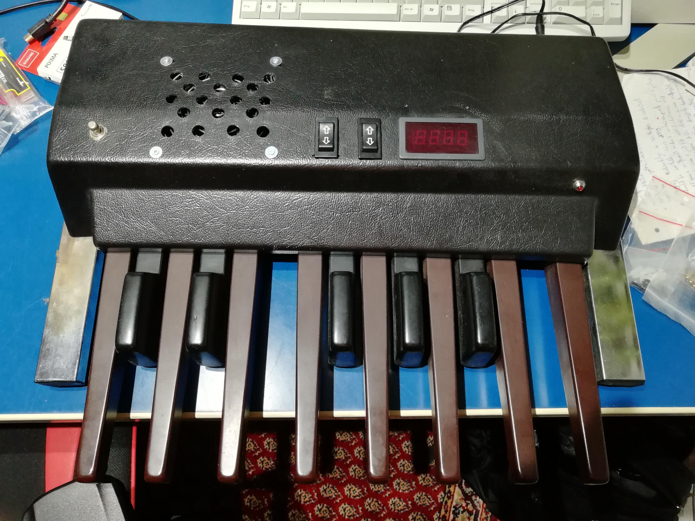
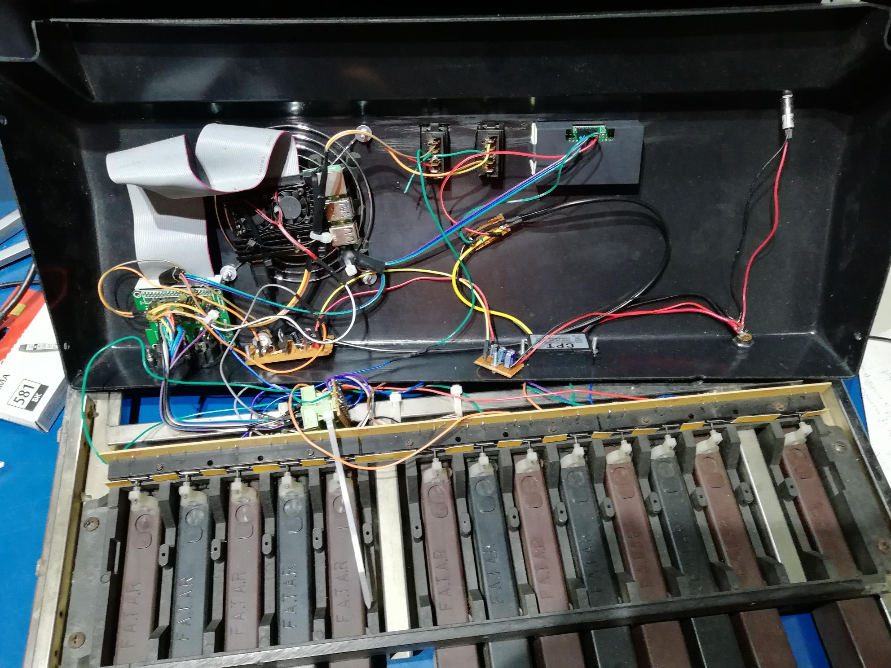

# Architecture

The sampler is supposed to run on a Raspberry Pi 4 with an HiFiBerry DAC+ pro XLR. It is mounted in old combo organ foot register, which keys are connected to the Pi's GPIOs to trigger sounds. For my use case, polyphony may be limited to 4, but the samples might be relatively long (like a minute). Note replay might be gated or one-shot, velocity isn't used. I wanted to mount a 7-segment display to show the currently selected bank, but that, as well as a panic button and volume controls had to go. It turned out less of the GPIOs can be used than I thought, as they are already used by the DAC. For setting up sounds, the PI can be accessed via RDP. A GUI might be nice, but so far it seems overkill. The RDP connection can only established when the PI can connect to a known Wi-Fi, but it might be nice to edit sound banks "on the road". I wonder if the PI could open a Wi-Fi hotspot for that, otherwise using the ethernet connection would be an easy solution, at least when connecting via a notebook instead of a phone. All that talk about network makes me think that a web interface would be nice for this too.

## Hardware prototype

The GPIOs 4,7-11,14,15,17,22-27 (15 in total) are actually available, the rest can't be used, so for more keys you need to multiplex inputs or maybe use a MIDI interface to trigger sounds. I for one want to want to keep it simple and work closer to the metal than buying a plug-and-play midi controller.



This is the pedal hardware, notice that the display, the panic button on the left and one of the arrow buttons isn't connected due to lack of GPIOs.


These are the insides of the pedal, the power is supplied by an external 12V@2A DC power supply, which is regulated down to the necessary 5V with sufficient filtering to avoid the switching power supply to cause noises on the output. All the active components are mounted to the top, the pedals have plug connection, so the electronics can be accessed easier when necessary.

## Software components

main.rs     Initialize the audio host and open the playback stream
```
main(){
    initAudioBoilerPlate();
    initInputWatches();
    initBanks();
    initBankChangeWatches();
    loop{
        outputloop(mixer());
    }
}
```

mixer.rs    Blend all voices sample by sample and supply the playback stream with the latest one, handle volume control
```
voice{
    bool play;                   // play sample?
    bool loop;                   // loop sample?
    uint activeSample;           // which sample to play
    uint activeSamplePlayHead;   // current sample read position
    out(){
        if !loop && activeSamplePlayHead >= banks[currentBank][activeSample].size {
            play = false;
        }
        if !play {
            return;
        }
        return banks[currentBank][activeSample][activeSamplePlayHead++];
    }
}

mixer(){
    for v in voices
    {
        output += v.out();
    }
    // Hold back some samples for soft clipping or use a simple wave shaper?
    return output;
}
```

input.rs    Handle the GPIO readout and trigger events for playing back samples and switching banks
```
initInputWatches(){
    watch GPIOs, add new voice to voices (lifo-stack)
}

initBankChangeWatches(){
    watch GPIOs, block playing new voices (inputWatches)
    loadNextBank();
}
```

loader.rs   Load sound banks
```
initBanks()
{
    for folders in samples{
        addBank(); // Load wav files and prepare for playback
                  // Hold all of it in memory or do we have to load each bank when requested?
    }
    currentBank = 0;
}

loadNextBank(){
    load currentBank++;
}
```


    .
    └── samples                    
        ├── 000                 # Folder for each sound bank
        │   ├── c.wav           # Samples are assigned to the right key by the file name
        │   ├── cis.wav
        │   ├── ...
        │   ├── b.wav
        │   ├── c2.wav
        │   └── playback.json   # A config file might be added to pick which sound is to be played one-shot or gated 
        ├── 001         
        └── 002               
Proposed folder structure to describe sound banks
